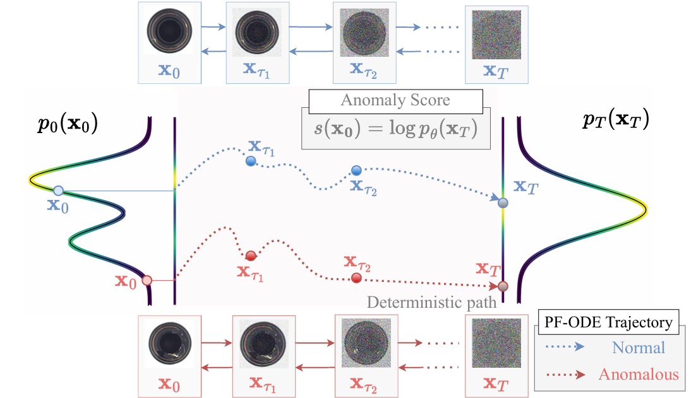

# Reconstruction-Free Anomaly Detection with Diffusion Models via Direct Latent Likelihood Evaluation <br><sub>Official PyTorch Implementation</sub>

[](https://arxiv.org/abs/2504.05662)&nbsp;
[](https://skyshunsuke.github.io/InversionADProject/)
[](https://www.alphaxiv.org/abs/2504.05662)

<p align="center">
  
</p>

This is a official PyTorch implementation of the paper [Reconstruction-Free Anomaly Detection with Diffusion Models](https://arxiv.org/abs/2504.05662):

```
@article{sakai2025inversionad,
      title={Reconstruction-Free Anomaly Detection with Diffusion Models}, 
      author={Shunsuke Sakai, Xiangteng He, Chunzhi Gu, Leonid Sigal, Tatsuhito Hasegawa},
      year={2025},
      url={https://arxiv.org/abs/2504.05662}, 
}
```

## Preparation

### Installation
Download the code:
```
git clone https://github.com/SkyShunsuke/InversionAD.git
cd InversionAD
```

A suitable [conda](https://conda.io/) environment named `invad` can be created and activated with:
```
conda env create -f environment.yaml
conda activate invad
```
For pip installation, you can install the required packages with:
```
pip install -r requirements.txt
```

### Set up for Evaluation
To run the evaluation, you need to install the `adeval` package. You can do this by running the following command:

```bash 
cd src && git clone https://github.com/winggan/adeval.git && cd ..
```

### Dataset
Download [MVTecAD](https://www.mvtec.com/company/research/datasets/mvtec-ad) dataset with the following command:
```bash
bash scripts/download_datasets.sh
```
and place it in the `data` directory. 

### Wandb Logging [Optional]
If you want to use Weights & Biases for logging, please make .env file in the root directory and set your wandb API key as follows:
```
WANDB_API_KEY=your_api_key
```
You can get your API key from [here](https://wandb.ai/authorize).
You can also set the project name and entity from the .env file:
```
WANDB_PROJECT=your_project_name
WANDB_ENTITY=your_entity_name
```

## Usage

### Training
To train the model, run the following command:

```
bash scripts/train.sh
```

This will train the model on the MVTecAD dataset. The training process will save the model checkpoints in the `results` directory.

And you can change training parameters in `configs/xxx.yaml` file.

> **⚠️ NOTE — Training requirements**
>
> Training diffusion models requires significant compute. We recommend a machine with at least **24 GB of GPU memory**. You do not need H200 GPUs as used in the paper — any GPU with larger memory will make training easier. To reduce memory requirements consider using **mixed precision (AMP)**, **smaller batch sizes**, or **gradient accumulation**.

### Evaluation
To evaluate the model, run the following command:
```
bash scripts/eval.sh
```
This will evaluate the model on the MVTecAD dataset.

## Pre-trained Models
We provide pre-trained models for accelerating reproduction process. You can download the pre-trained models from [Google Drive](https://drive.google.com/drive/folders/1o1cndW7i6GLIlYG730Ec1F2DSeemsjPl?usp=drive_link) and place them in the `weights` directory.

Loaded weights and configs are compressed in the `weights/[model_name]_[dataset].zip` file. You need to unzip them before evaluation. Then, you can specify the model name and dataset in the `scripts/eval.sh` file.

For now, we only provide models for multi-class AD on following datasets:
- MVTecAD
- VisA
- MPDD
- BMAD
If you want to get the access to the other pre-trained models, including single-class AD models, Real-IAD models, ablation models, please contact me via email(sshunsuke0102@gmail.com) or build issue.

## Acknowledgements
We thank for very nice diffusion implementation from [OpenAI](https://github.com/openai/guided-diffusion). 

## Contact
If you have any questions, feel free to contact me through email (sshunsuke0102@gmail.com).


